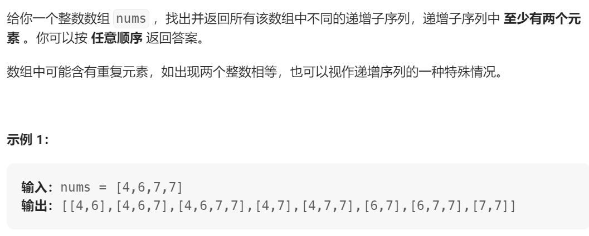

## 491. 递增子序列



参数：nums, start, path, res

递归跳出条件: 遍历到最后直接退出，记录符合条件的节点
- if len(path) > 1: res.append(path[:])

递归逻辑：
- 使用set判断同层，使用过的元素应跳过 
- `if (i > start and nums[i] < path[-1]) or nums[i] in uset`
- `backTracking(nums, i + 1, )`

```Python

def findSubsequences(self, nums: List[int]) -> List[List[int]]:
    res = []

    self.backTracking(nums, 0, [], res)

    return res

def backTracking(nums, start, path, res):
    if len(path) > 1:
        res.append(path[:])
    uset = set()
    for i in range(start, len(nums)):
        if (i > start and nums[i] < path[-1]) or nums[i] in uset:
            continue
        uset.add(nums[i])
        path.append(nums[i])
        self.backTracking(nums, i+1, path, res)
        path.pop()
```