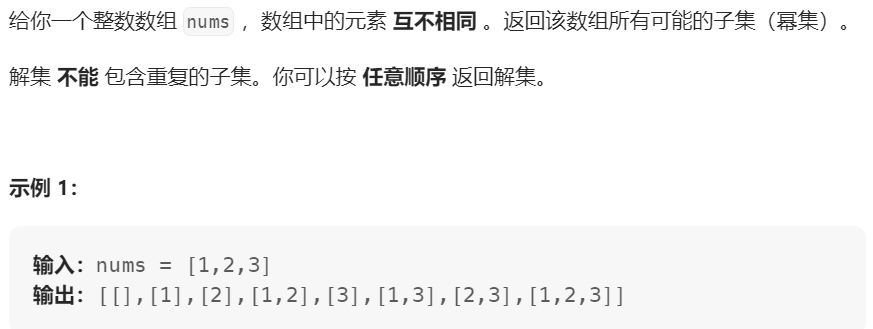
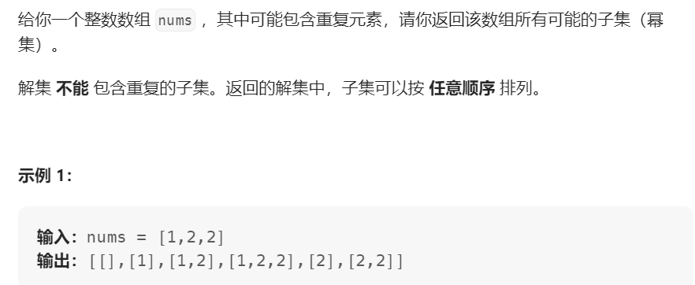

## 78. 子集


同**组合问题**相比：类似遍历一棵树，组合问题需要保存数的叶子节点

而**子集问题** 树的每个 节点 都要保存一次

```Java
class Solution {

    List<List<Integer>> res = new ArrayList<>();
    List<Integer> path = new ArrayList<>();
    public List<List<Integer>> subsets(int[] nums) {
        subsetsHelper(nums, 0);
        return res;
    }

    private void subsetsHelper(int[] nums, int startIndex) {
        res.add(new ArrayList(path));
        if (startIndex >= nums.length) {
            return;
        }
        for (int i=startIndex; i<nums.length; i++) {
            path.add(nums[i]);
            subsetsHelper(nums, i+1);
            path.remove(path.size() - 1);
        }
    }
}
```

## 90. 子集 II



同78，但是需要考虑去重问题，即树层去重

```Java
List<List<Integer>> res = new ArrayList<>();
List<Integer> path = new ArrayList<>();
public List<List<Integer>> subsets(int[] nums) {
    subsetsHelper(nums, 0);
    return res;
}

private void subsetsHelper(int[] nums, int startIndex) {
    res.add(new ArrayList(path));
    
    for (int i=startIndex; i<nums.length; i++) {
        if (i > 0 && nums[i] == nums[i-1]) {
            continue;
        }
        path.add(nums[i]);
        subsetsHelper(nums, i+1);
        path.remove(path.size() - 1);
    }
}
```
Python
```Python

nums.sort()


def backTracking(nums, start, path, res):
    res.append(path[:])

    for i in range(start, len(nums)):
        if i > start and nums[i] > nums[i-1]:
            continue
        
        path.append(nums[i])
        backTracking(nums, i+1, path, res)
        path.pop()
```


