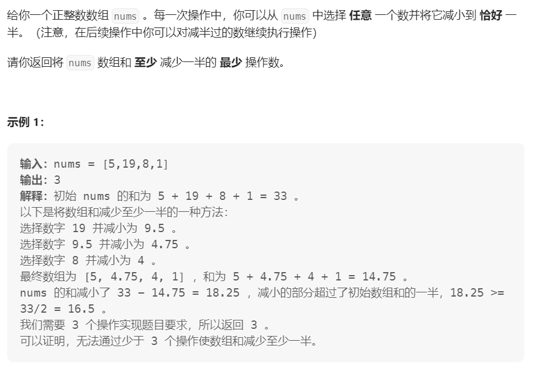

## 2208. 将数组和减半的最少操作次数



每次选取数组中最大的值减半，直到 数组和 小于等于 最初数组和的一半

类似这类 需要 动态维护 数组中最大元素 的情况，可以使用 **优先队列** `PriorityQueue<>`

```java
class Solution {
    public int halveArray(int[] nums) {
        PriorityQueue<Double> pq = new PriorityQueue<Double>((a, b) -> b.compareTo(a));
        double sum = 0;
        for (int num : nums) {
            pq.offer((double) num);
            sum += num;
        }

        double half = sum / 2;
        int res = 0;
        double sum2 = 0.0;

        while (sum2 < half) {
            double x = pq.poll();
            sum2 += x / 2;
            pq.offer(x / 2);
            res++;
        }

        return res;
    }
}
```